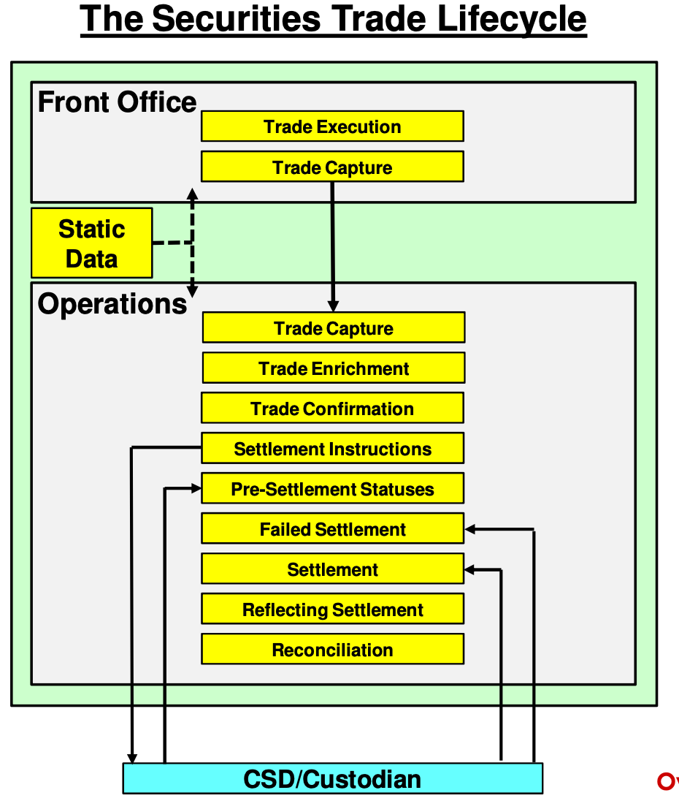
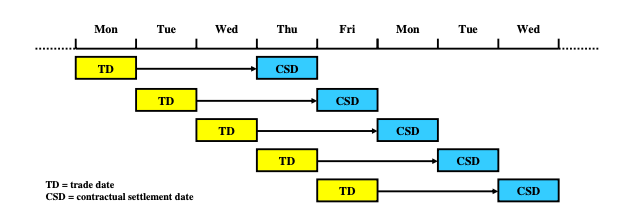
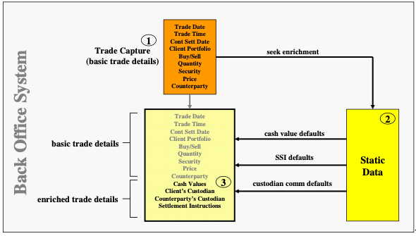
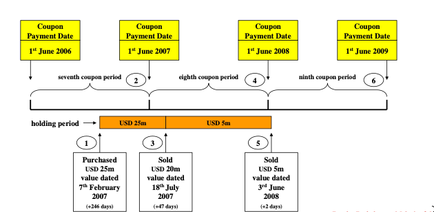

# The Security Trade Lifecycle

[Udemy - Securities Trade Lifecycle](https://www.udemy.com/course/the-securities-trade-lifecycle/)

- [Overview](#overview)
- [Trade Capture](#trade-capture)
- [Trade Enrichment](#trade-enrichment)

## Overview

The securities trade lifecycle includes several discrete steps that must be completed for a successful trade.
1. Trade Capture
2. Trade Enrichment
3. Trade Confirmation
4. Trade Settlement
5. Reconciliation




A *trade* is a legal agreement to buy or sell goods in exchange for cash. The *buyer* receives the goods and pays cash simultaneously. The *seller* delivers the goods and receives cash simultaneously.

A *trade execution* is an agreement to undertake a specific securities trade on specific terms between two parties.

Trade executions were historically created between traders on the "trading floor". Market makers advertise their prices on "pitches" (cards).

Today, trades are typically completed in order-driven markets or quote-driven markets.

Orders (unfulfilled executions) are facilitated on an *order-driven market*, in which a buyer and seller are matched based on the terms of the trade. Order-driven markets are usually categorized by automatic electronic execution.

In contrast, *quote-driven markets* are based around bid/ask price quotes that attract investors.

In order to make a trade, market makers/trades need immediate knowledge of whether new trades result in profit or loss. This requires knowledge of the current trading position and its average price.

> The *current trading position* is the accumulated effect of all purchases and sales. 
>
> E.g., Marco performs the following trades:
> | Activity | Shares | Position |
> | --- | --- | --- |
> | Buy | 500 | 500 |
> | Buy | 200 | 700 |
> | Sell | 150 | 550 |
> | Buy | 70 | 620 |

**How is a trade execution initiated?**

*From the perspective of an institutional investor (e.g., hedge fund, asset manager):*
1. Investment manager makes an investment decision
2. Investment manager communicates an order to the executing broker (e.g., buy 10 million shares at market price)

*From the Broker's perspective:*
1. Salesperson records detail of order, including:
    - client account at "block" level or client account at "allocation" level
    - buy or sell
    - quantity
    - specific security
    - desired price (e.g., limit, market)
2. Salesperson forwards order to trader

When an order is received by the broker, it acts as an agent or principal.
- **Agent**: broker attempts to find a 3rd party willing to trade on the terms of the order (typically for a commission/brokerage fee)
- **Principal**: broker trades off of trading book, thereby increasing/decreasing its current position for that security

## Trade Capture

Trade capture is the process of formally recording details of an individual trade execution.

The trader must record trade details within the front office trading system, namely:
- dates
- buy or sell
- quantity
- security
- market
- price
- internal owner
- counterparty

**Dates**

- trade date: the date the trade was executed
- trade time: regulatory requirement to record HH/MM
- value date (contractual settlement date): intended date of settlement (i.e., exchange of securities and cash)

A rolling trade date species a contractual settlement date of:
```
CSD = trade date + x    
    where x = some amount of business days
```



*Table Caption (below): Default CSD per security type*
| Security Type | CSD Offset|
| --- | --- |
| US Equity | T+3 |
| UK Equity | T+3 |
| UK Equity | T+1 |
| US Treasury Bonds | T+1 |

These defaults can be overridden when agreed by both counterparties.

**Buy or Sell**  
**Quantity**
- Shares: expressed as a number
- Bond: expressed as a nominal amount

**Security**

The exact issue being traded must be recorded. Many bonds may have almost identical details (e.g., World Bank).
- issuer
- coupon rate
- maturity date

Every unique security has an ISIN.

**Market**

Some securities trade in multiple markets (e.g., NYSE, Frankfurt).

**Price**

Equity prices are captured in price per share (e.g., USD 6.10).

Bond prices are expressed in the percentage of the nominal amount/face value (e.g., 98.25%).

**Internal Owner**

Define the proprietary trader or trading book that executed the trade.

**Counterparty**

The counterparty must record the exact counterparty including its location.

E.g., Trade Capture

| Trade Component | Example |
| --- | --- |
| Trade Date | 20th October |
| Trade Time | 0847 |
| Value Date | 23rd October |
| Trading Book | Book T |
| Buy or Sell | Buy |
| Quantity | 12,000,000,00 |
| Security | Xerox Corporation USD 1.00 Common Stock |
| Price | USD 2.88 Net |
| Counterparty | Deutsche Bank, London |

Trades should be captured as soon as possible.

A trade record is created within the IBOR system (Internal Book of Record). The trade record will be held as *open* until the settlement date occurs.

Before the settlement date, the investment firm is exposed to counterparty risk.

## Trade Enrichment

Trade enrichment is the process of adding essential information to the basic trade details captured previously. The additional essential information is necessary to facilitate full operational processing.

Systems must be preloaded with static security data in order to enrich trade captures based on pre-defined enrichment rules with the Operations system.



The settlement system must generate a unique trade reference number that can be used to reference the trade.

The settlement system must also generate relevant charges for the trade.
- e.g., The SEC charges 1/300th of 1% of gross consideration on US equities (payable by seller)
- e.g., The UK govt charges a stamp duty of 0.5% of gross consideration on UK equities (payable by buyer)
- e.g., Calculate accrued interest on interest-bearing bonds based on the number of accrued days

*Caption (below): Bonds accrue interest every day, but coupons are only paid periodically. When an interest-bearing bond is sold between coupon dates, the accrued interest must be calculated and considered in the price of a trade.*


The settlement system must also enrich trades with commission, net settlement value (final cash amount due to/from counterparty), firm's custodian SSI, and counterparty custodian SSI.

The settlement basis desribes how settlement will occur:
- *delivery versus payment (DVP)* - simultaneous exchange of a security for cash
- *free of payment (FOP)* - the security can be for given before payment occurs.
