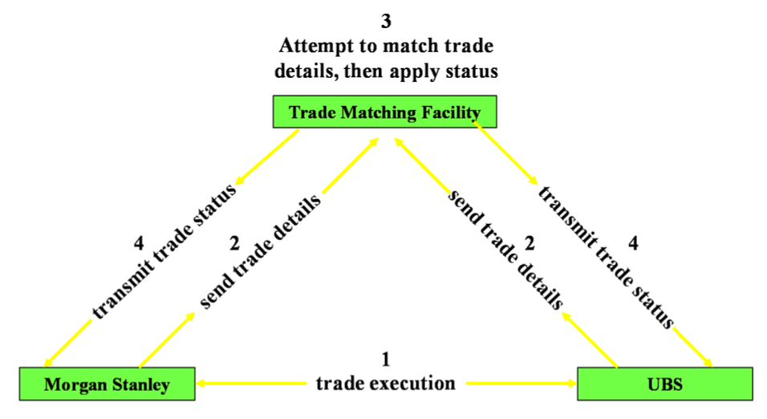
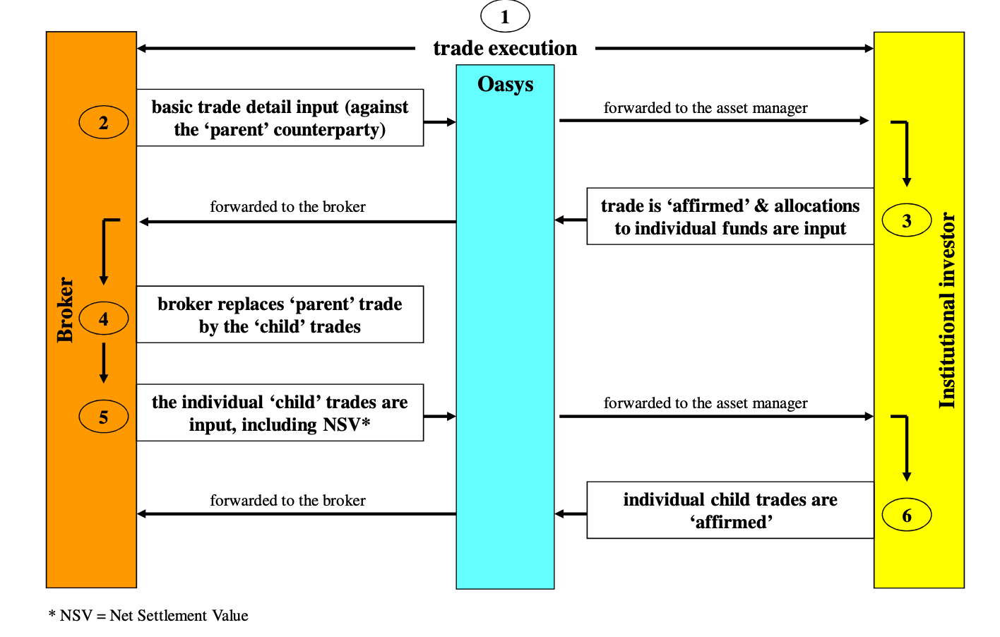
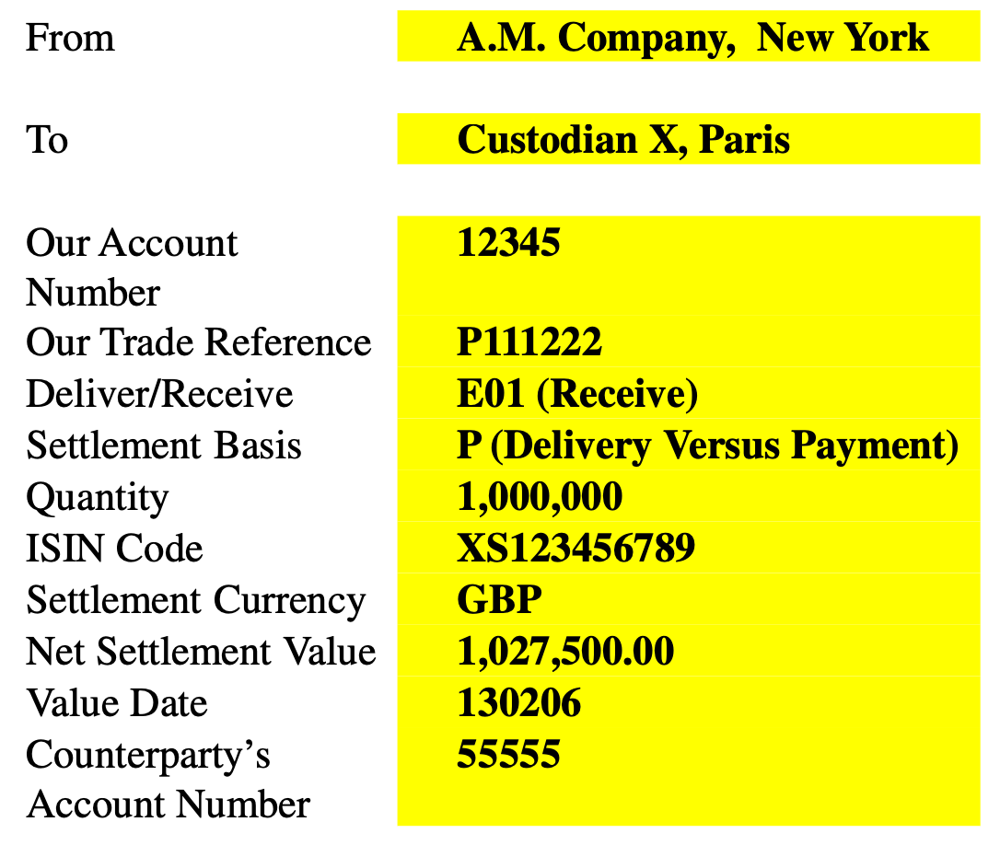
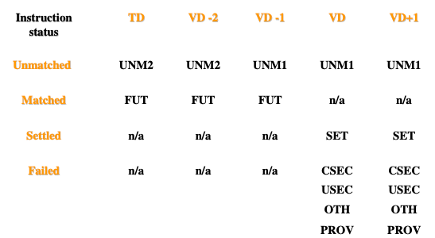
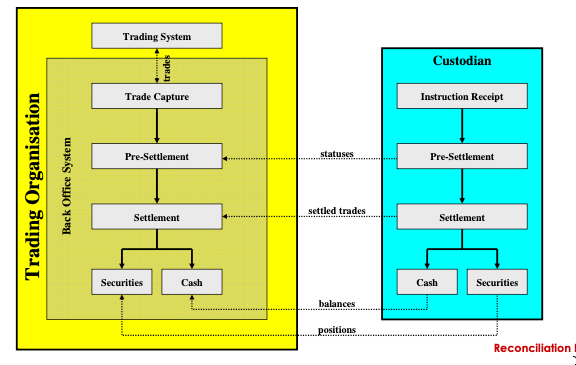

# The Security Trade Lifecycle

[Udemy - Securities Trade Lifecycle](https://www.udemy.com/course/the-securities-trade-lifecycle/)

- [Overview](#overview)
- [Trade Capture](#trade-capture)
- [Trade Enrichment](#trade-enrichment)
- [Trade Confirmation](#trade-confirmation)
- [Trade Settlement](#trade-settlement)
- [Reconciliation](#reconciliation)

## Overview

The securities trade lifecycle includes several discrete steps that must be completed for a successful trade.
1. Trade Capture
2. Trade Enrichment
3. Trade Confirmation
4. Trade Settlement
5. Reconciliation


A *trade* is a legal agreement to buy or sell goods in exchange for cash. The *buyer* receives the goods and pays cash simultaneously. The *seller* delivers the goods and receives cash simultaneously.

A *trade execution* is an agreement to undertake a specific securities trade on specific terms between two parties.

Trade executions were historically created between traders on the "trading floor". Market makers advertise their prices on "pitches" (cards).

Today, trades are typically completed in order-driven markets or quote-driven markets.

Orders (unfulfilled executions) are facilitated on an *order-driven market*, in which a buyer and seller are matched based on the terms of the trade. Order-driven markets are usually categorized by automatic electronic execution.

In contrast, *quote-driven markets* are based around bid/ask price quotes that attract investors.

In order to make a trade, market makers/trades need immediate knowledge of whether new trades result in profit or loss. This requires knowledge of the current trading position and its average price.

> The *current trading position* is the accumulated effect of all purchases and sales. 
>
> E.g., Marco performs the following trades:
> | Activity | Shares | Position |
> | --- | --- | --- |
> | Buy | 500 | 500 |
> | Buy | 200 | 700 |
> | Sell | 150 | 550 |
> | Buy | 70 | 620 |

**How is a trade execution initiated?**

*From the perspective of an institutional investor (e.g., hedge fund, asset manager):*
1. Investment manager makes an investment decision
2. Investment manager communicates an order to the executing broker (e.g., buy 10 million shares at market price)

*From the Broker's perspective:*
1. Salesperson records detail of order, including:
    - client account at "block" level or client account at "allocation" level
    - buy or sell
    - quantity
    - specific security
    - desired price (e.g., limit, market)
2. Salesperson forwards order to trader

When an order is received by the broker, it acts as an agent or principal.
- **Agent**: broker attempts to find a 3rd party willing to trade on the terms of the order (typically for a commission/brokerage fee)
- **Principal**: broker trades off of trading book, thereby increasing/decreasing its current position for that security

## Trade Capture

Trade capture is the process of formally recording details of an individual trade execution.

The trader must record trade details within the front office trading system, namely:
- dates
- buy or sell
- quantity
- security
- market
- price
- internal owner
- counterparty

**Dates**

- trade date: the date the trade was executed
- trade time: regulatory requirement to record HH/MM
- value date (contractual settlement date): intended date of settlement (i.e., exchange of securities and cash)

A rolling trade date species a contractual settlement date of:
```
CSD = trade date + x    
    where x = some amount of business days
```


*Table Caption (below): Default CSD per security type*
| Security Type | CSD Offset|
| --- | --- |
| US Equity | T+3 |
| UK Equity | T+3 |
| UK Equity | T+1 |
| US Treasury Bonds | T+1 |

These defaults can be overridden when agreed by both counterparties.

**Buy or Sell**  
**Quantity**
- Shares: expressed as a number
- Bond: expressed as a nominal amount

**Security**

The exact issue being traded must be recorded. Many bonds may have almost identical details (e.g., World Bank).
- issuer
- coupon rate
- maturity date

Every unique security has an ISIN.

**Market**

Some securities trade in multiple markets (e.g., NYSE, Frankfurt).

**Price**

Equity prices are captured in price per share (e.g., USD 6.10).

Bond prices are expressed in the percentage of the nominal amount/face value (e.g., 98.25%).

**Internal Owner**

Define the proprietary trader or trading book that executed the trade.

**Counterparty**

The counterparty must record the exact counterparty including its location.

E.g., Trade Capture

| Trade Component | Example |
| --- | --- |
| Trade Date | 20th October |
| Trade Time | 0847 |
| Value Date | 23rd October |
| Trading Book | Book T |
| Buy or Sell | Buy |
| Quantity | 12,000,000,00 |
| Security | Xerox Corporation USD 1.00 Common Stock |
| Price | USD 2.88 Net |
| Counterparty | Deutsche Bank, London |

Trades should be captured as soon as possible.

A trade record is created within the IBOR system (Internal Book of Record). The trade record will be held as *open* until the settlement date occurs.

Before the settlement date, the investment firm is exposed to counterparty risk.

## Trade Enrichment

Trade enrichment is the process of adding essential information to the basic trade details captured previously. The additional essential information is necessary to facilitate full operational processing.

Systems must be preloaded with static security data in order to enrich trade captures based on pre-defined enrichment rules with the Operations system.


The settlement system must generate a unique trade reference number that can be used to reference the trade.

The settlement system must also generate relevant charges for the trade.
- e.g., The SEC charges 1/300th of 1% of gross consideration on US equities (payable by seller)
- e.g., The UK govt charges a stamp duty of 0.5% of gross consideration on UK equities (payable by buyer)
- e.g., Calculate accrued interest on interest-bearing bonds based on the number of accrued days

*Caption (below): Bonds accrue interest every day, but coupons are only paid periodically. When an interest-bearing bond is sold between coupon dates, the accrued interest must be calculated and considered in the price of a trade.*


The settlement system must also enrich trades with commission, net settlement value (final cash amount due to/from counterparty), firm's custodian SSI, and counterparty custodian SSI.

The settlement basis desribes how settlement will occur:
- *delivery versus payment (DVP)* - simultaneous exchange of a security for cash
- *free of payment (FOP)* - the security can be for given before payment occurs.

## Trade Confirmation

A trade confirmation is a formal advice of trading issued to or received from a counterparty for the purpose of confirming trade details.

Trade confirmations reduces risk by serving as a legal defense mechanism against future liabilities. 

If a trade confirmation is not issued, the investment firm jeopardizes relationships with institutional clients due to lack of service. It also introduces a risk of regulatory fines.

Trade confirmations should be issued as soon as possible after trade execution.

Trade confirmations can be issued in many forms:
- paper (contract notes)
- telex
- fax
- SWIFT (Society for Worldwide Interbank Financial Telecommunications)
- ETC (Electronic Trade Confirmation)

*Note: MT515 is the SWIFT message type for trade confirmations.*

Electronic Trade Confirmation (ETC) is a market-wide facility that is used to confirm trades. In most cases, using ETC is mandatory by a specified deadline, lest fines be imposed.

Electronic trade matching facilities can be used to facilitate trade confirmation.

*Caption (below): Morgan Stanley and UBS execute a trade with each other. Both investment banks send the trade details to the trade matching facility for confirmation. If details of the trade do not match, the parties are notified.*



*OASYS* is a form of ETC called *trade affirmation*, in which the validation of trade details is sequential.



Discrepencies in trade details may be grouped into economic or non-economic. 

*Economic discrepencies* include details like quantity, price, buy/sell, counterparty, trade date, or value date. These types of trade descrepencies must be fixed by the trader (front office), not operations (back office).

Non-economic discrepencies includes details like brokers. In this case, operations can fix the trade details in the static data without involving traders.

## Trade Settlement

A *settlement instruction* is a message issued by an account holder to a CSD/custodian to execute movements of securities and/or cash in order to settle securities trades.

Settlement instructions are required for money to change hands. If no settlement instructions are issued, trade settlement would fail.

There are three types of settlement instructions:
- securities vs cash (DvP) 
- securities only (FoP)
- cash only (FoP)

DvP occurs 99% of the time.

*Caption (below): E.g., settlement insructions*
- *Deliver/Receive specifies an instruction of E01. This instruction is always from the perspective of the security.*
- *The settlement basis is P, which signifies delivery vs payment. This in contrast to code F (free of payment).*



Generally, trade settlement instructions deadlines are defined by the exchange, or even depot, associated with the trade.

E.g., Euroclear
    - 1845 evening prior to value date (if made by Euclid or SWIFT)
    - 1000 morning prior to value date (if made by telex or fax)

Generally, investment firms try to issue settlement instructions on the trade date.

S.W.I.F.T. supports the following message types for settlement:
- MT540 (Receive FoP)
- MT541 (Receive DvP)
- MT542 (Deliver FoP)
- MT543 (Deliver DvP)

Alternatively, investment banks may use CSD/custodian proprietary system (e.g., Euclid of Euroclear).

Typically, the operations system (back office) is responsible for issuing settlement instructions to custodians.

There are several risks in the settlment process:
- Miss the settlement instruction deadline
- Instructions issued, but not received by depot or nostro
- Issuing FoP instructions without internal authorization
    - E.g., selling - potential to deliver securities without equivalent monetary value
    - E.g., buying - potential to pay cash without equivalent securities value
- Falsified instructions - securities or cash removed from account at CSD/custodian potentially without limit.

*Pre-settlement status* is a condition applied to a settlement instruction by a CSD/custodian reflecting the *matched* status. The status is derived following receipt of a settlement instruction by a CSD/custodian. The custodian will attempt to match the instruction with the counterparty.
- The **matched** status is applied when all details match perfectly. The cash value can be different and still be considered matching if within a tolerance band (e.g., cash difference of USD12 compared with max tolerance allowance of USD25).
- The **unmatched** status is applied when differences exist between the instructions from the firm and the counterparty, or instructions are missing from the counterparty.
- **Advisory/alleged** status is used when instructions are missing from the firm.

*Caption (below): This table shows a matrix of possible settlement instruction status based on scenarios (vertical) in relation to the value date (horizontal).*


| Statues | |
| --- | --- |
| CSET | Counterparty does not have suffient securities |
| FUT | Matched, waiting for value date |
| OTH | Counterparty does not have sufficient cash |
| PROV | Firm does not have sufficient cash |
| SET | Settled |
| UNM1 | Unmatched, priority 1 |
| UNM2 | Unmatched, priority 2 |
| USEC | Firm does not have sufficient securities |

When a trade is unmatched, the following actions must be taken:
- Prioritize which trades need attention first (e.g., closest to settlement date, large cash values)
- Determine nature of the difference and assign ownership (e.g., trader vs operations)
- Initiate fix with the responsible group

A failed settlement is a trade in which the securities and/or cash have not been exchanged with the counterparty on value date. Despite the failure, both parties are still locked-in to original trade cash values. In other words, settlement is only delayed, not canceled.

When a trade fails, it has negative impacts, including:
- monetary loss - not recieving cash from buyer as well as cash interest loss.
- increased exposure to counterparties

In some markets, rate of successful settlement is 100% due to regulations and penalties associated with failed settlements.

Some markets allow for partial settlement when agreed upon by the buyer and seller. In some markets, partial settlment is compulsory. The partial settlement is for a specified number of securities at a pro-rata cash amount. Both parties must resubmit new settlement instructions reflecting the new details of the partial trade.

Once a trade is settlement, internal books of records must be updated based on settlement advices received and unique trade reference numbers.

## Reconciliation

Reconciliation is a fundamental and essential control process to verify that internal book of records match. The internal book of records of clients' securities and cash are accurate when compared with custodians' records.

- *FOBO Trades* - Reconcile trades captured in the front-office trading system versus the back-office operational system.
- *FOBO Position* - Reconcile trading book positions within trading system verses back-end operational system at individual securities position level.
- *Depot Position* - Reconcile settled securities positions within back-office operational system with custodian statements at individual securities position level.
- *Nostro Position* - Reconcile settled cash position within accounting system versus custodian statements at account level by currency.

*Caption (below): Example sequence diagram of dimensions of reconciliation with a custodian.*



Reconciliation should occur quickly and regularly. Doing so will quickly identify any errors in internal systems or custodian accounts at the point at which they arose.

Generally, reconciliation is performed by:
1. Gathering input such as statements (e.g., custodian statements, internal statements).
2. Identity the point of the last reconciliation (i.e., brought-forward balances).
3. Reconcile individual movements from that point until the present.
4. Identify any non-reconciling items.
5. Investigate and rectify non-reconciling items.
    - contact apprioriate department (e.g., traders, settlement, corporate actions)
    - gain agreement over rectifying action
    - document agreed action
    - monitor to ensure agreed action is effected
